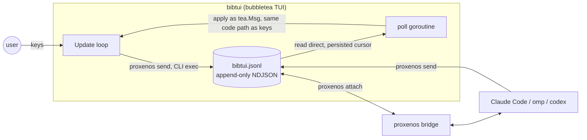

# bibtui ↔ proxenos: the event contract

bibtui is an "app" in [proxenos](https://github.com/dshumphr/proxenos) terms:
it emits events onto a stream when the user acts, and applies events the
agent sends back. This is the third pillar of `PLAN.md` ("AI integration")
made concrete. See proxenos's own `docs/app-integration.md` for the
middleware-side contract this document is written against.

Machine-readable seed contract: [`proxenos-contract.json`](proxenos-contract.json)
(feed it to `proxenos new bibtui --contract docs/proxenos-contract.json`).

## Architecture



Outbound (bibtui → stream): shell out to `proxenos send` per event. Gets
id-stamping, identity, and stream-existence validation for free — no reason
to reimplement it.

Inbound (stream → bibtui): bibtui reads the NDJSON file directly with a
persisted cursor (see "Cursor & idempotency" below), polling like proxenos's
own bridge does (250ms, `stat` by (dev,inode) to catch replace/compact).
Not a subprocess: no long-lived `proxenos tail -f` child to babysit through
every bubbletea exit path. Applied events become `tea.Msg` fed through
`Program.Send`, landing in `Update()` and running through the **same**
state-mutation helpers (`withContent`, `resolveGoto`, `withToggled`, …) a
keypress would use — one code path for "user pressed `]`" and "agent sent
`nav.step`", not two that can drift.

## Emitted events (bibtui → stream)

Low-frequency, semantic — never per-scroll-line, per the cost model
(proxenos `app-integration.md` §"Cost model").

| Event | Fires on | Body | Notes |
|---|---|---|---|
| `app.started` | process start | `{translations, resumed}` | once |
| `read.location` | chapter change: `]`/`[`, resolved `:goto`, `n` (new session), session resume | `{translations, book, chapter, ref}` | discrete already, no debounce needed |
| `read.translations` | `o` picker toggles the active pane set | `{translations}` | |
| `annotation.groups_changed` | `a` picker changes selected annotation groups | `{active}` | durable preferences; selection survives panel hide/show |
| `annotation.panel_changed` | `A` hides or shows the annotation panel | `{open}` | visibility only; never changes selected groups |
| `note.created` / `note.updated` / `note.deleted` | inner note UI save/delete, **by either author** | `{id, author, book, chapter, verse, text}` (update/delete omit ref) | user actions surfaced to the agent too — "almost any human action AI-visible" cuts both ways |
| `user.message` | new `?` ask-prompt, Enter | `{text, book, chapter, verse, ref}` | canonical single type for questions *and* imperatives, current position always attached so the agent never has to cross-reference a separate `read.location` |
| `action.rejected` | an inbound accepts-event bibtui couldn't/wouldn't apply | `{action, id?, reason}` | ack/nack loop — silent failure is worse than a loud one |
| `app.exited` | quit (`q`/ctrl-c), best-effort | `{}` | |

**Deliberately not emitted:** raw scroll position, picker cursor movement,
goto-candidate navigation, delete-confirm keystrokes. These are UI widget
mechanics for a human typing ambiguously — a programmatic caller specifies
`nav.goto{book,chapter,verse}` precisely and skips the disambiguation UI
entirely. Emitting them would violate the cost model for zero benefit.

**Deliberately no `<ns>.snapshot`:** bibtui's state already lives in small
local files (`session.json`, `stats.json`, `annotations.json`,
`divergence.json`) — "files over apps" is already true here. A harness
agent has shell access to the same working directory and can read those
directly for full context; mirroring them into the stream as a snapshot
event would just be a second, driftable copy of the same data.

## Accepted actions (stream → bibtui)

Every entry is a direct action parity with a human keybinding — "almost
any human action should be AI-accessible."

| Action | Body | Human equivalent | Behavior |
|---|---|---|---|
| `nav.goto` | `{book, chapter, verse?}` | `:` goto + Enter | `book` may be canonical slug or exact/prefix display name, resolved via the existing `bookCandidates`/`findIndexPos`; ambiguous or unmatched → `action.rejected`, never a silent no-op |
| `nav.step` | `{direction: "next"\|"prev"}` | `]` / `[` | no-op (not rejected) at the first/last chapter |
| `translations.set` | `{translations: [...]}` | `o` picker, toggle-by-toggle | **absolute set**, not toggle emulation — one round trip, idempotent by construction; unknown codes dropped, always clamps to ≥1 |
| `groups.set` | `{active: {name: bool, ...}}` | `a` picker | merge selected-group preferences: only listed keys change; panel visibility is untouched |
| `panel.set` | `{open: true\|false}` | `A` hide/show | absolute panel visibility; selected groups are untouched |
| `note.create` | `{id, book, chapter, verse, text}` | inner note UI, `+ new note` → save | caller-chosen stable id; resend same id → overwrite (idempotent per proxenos convention) |
| `note.update` | `{id, text}` | inner note UI, edit → save | only on notes this `src` authored |
| `note.delete` | `{id}` | inner note UI, `d` → `y` | only on notes this `src` authored — see Safety below |
| `answer` | `{text, refs}` | — | reply to a `user.message` (`reply_to` set); rendered in the ask overlay, not persisted as a note unless the agent also sends `note.create` |

**Deliberately withheld — human-only, no accepts event:**

- **Quit (`q`).** An agent must never be able to close the user's terminal
  session out from under them. Mirrors proxenos's own withholding of
  `rm`/`mv`/`attach` from injectable agents (`adapter-contract.md`).
- **Picker/goto candidate-list keystrokes** (`tab`, arrow-through-candidates,
  delete-confirm `y`/`n`). Disambiguation UI for imprecise human typing; a
  programmatic caller is precise by construction and uses `nav.goto` /
  `translations.set` / `groups.set` / `note.delete{id}` directly.
- **`r` (resume last session) has no dedicated action.** It's exactly the
  composition of `nav.goto` + `translations.set` + `groups.set` restoring
  the same fields `session.json` holds — and the agent can just read
  `session.json` itself (files over apps) rather than bibtui teaching it a
  fourth way to ask "where was I."

## Safety: note authorship

`Annotation` currently has no stable identity — notes are addressed
positionally (`ref` + index within that ref's slice). That's insufficient
for idempotent agent-authored notes and for the authorship check above, so
this integration requires two field additions:

```go
type Annotation struct {
    ID        string    `json:"id"`               // new: ULID, stable
    Author    string    `json:"author"`            // new: "user" | "agent:<name>"
    Ref       AnnotationRef `json:"ref"`
    Text      string    `json:"text"`
    Intensity *int      `json:"intensity,omitempty"`
    CreatedAt time.Time `json:"created_at"`
}
```

Notes created before this change get `author: "user"` on migration (default
zero value). The inner note UI marks agent-authored notes visually (e.g. a
small `🤖` glyph or the `agent:<name>` in a dim suffix) so the user always
knows who wrote what they're reading — never silently blend authorship.

`note.update` / `note.delete` from a given `src` are applied only if the
target note's `Author == src`; otherwise bibtui emits `action.rejected`
with `reason: "not authored by this agent"`. This is the one place a
malicious or confused prompt-injected agent could otherwise cause real
damage to the user's own data — closed at the store layer, not just by
convention.

## Cursor & idempotency

Full-history replay on every launch is *not* safe here, unlike the
reference reader's throwaway demo: `nav.goto` / `translations.set` /
`groups.set` are "apply now" commands, and resurrecting an old one after
the user has since navigated elsewhere on their own would fight the user on
every restart — a real correctness bug, not just wasted cycles.

bibtui therefore persists a small cursor (last-applied event `id`) in
`proxenos-state.json`, sitting next to `session.json`/`stats.json`. On
attach:

1. Scan the stream file **in append order** from byte 0.
2. Skip everything up to and including the remembered last-applied `id`.
3. Apply everything after it, in order; update the cursor after each
   successful (or rejected) apply.
4. If the remembered `id` isn't found (stream compacted/rewritten —
   `stream.meta` generation changed), fall back to attaching at end-of-file
   and skip catch-up entirely — the same re-baseline behavior proxenos's own
   bridge uses on generation mismatch (plan §6.1), translated to an id
   cursor since the CLI surface doesn't expose byte offsets.

Self-filter: bibtui ignores any event whose `src == "app:bibtui"` when
consuming inbound (its own emitted events echoing back), the same
self-filter convention the bridge itself uses (plan §6.3).

## Presence / "thinking"

No new machinery — the documented convention (`app-integration.md`
"Presence"): `?` sends `user.message` and opens an overlay showing
"thinking…"; an `answer` with matching `reply_to` replaces it; no reply
within ~2 minutes → "agent not responding — check `proxenos ls`," never a
silent hang.

## Setup (operator runbook)

```sh
proxenos new bibtui --contract docs/proxenos-contract.json   # once, idempotent (bibtui checks existence first)
proxenos attach bibtui --as main --agent claude --types user.message   # separate terminal / systemd unit
./bibtui kjv web                                               # the app itself
```

`--types user.message` is the recommended default: only real questions
wake (and pay for) a harness turn. `read.location` and `note.*` still land
on the stream for audit and for `--replay` context on
first attach — the agent sees recent navigation history the moment it
*does* wake, it just doesn't wake *for* navigation. A user who wants the
agent proactively commenting on navigation (e.g. flagging translation
divergence as they read) widens `--types` explicitly; that's an opt-in
cost, not a default one.

## Walkthrough

1. User reads John 3, navigates to it via `:goto` → emits `read.location`.
2. User presses `?`, types "what's the Greek behind Word here?" → emits
   `user.message{text, ref:"John 3:16"}`, overlay shows "thinking…".
3. Agent wakes (attached with `--types user.message`), sees the question —
   which already carries `ref:"John 3:16"` — sends
   `answer{text:"...Logos...", refs:["John 3:16"]}` and, unprompted-but-
   invited by the question,
   `note.create{id:"jn-3-16-logos", book:"john", chapter:3, verse:16, text:"..."}`.
4. bibtui's poll goroutine picks both up, clears "thinking…", renders the
   answer, and the note shows up in the annotation column marked
   `agent:claude`.
5. User disagrees, presses `n` → `d` on that same verse's agent note → `y`.
   Since `Author == "agent:claude" != "user"`, this is the user's own
   client-side delete on their own store — always allowed, no
   authorship check (the check only gates *inbound* stream commands).
